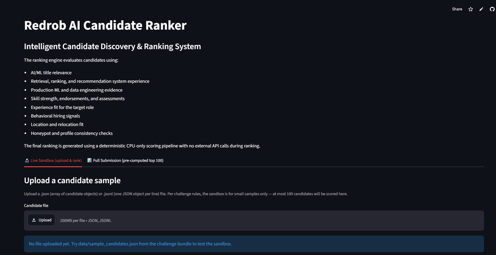
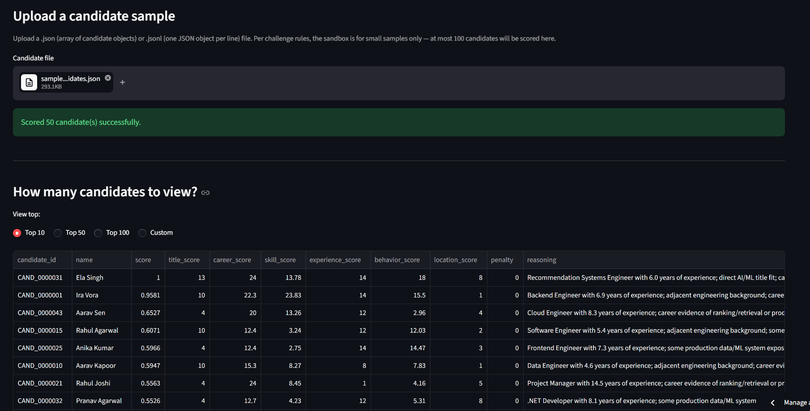
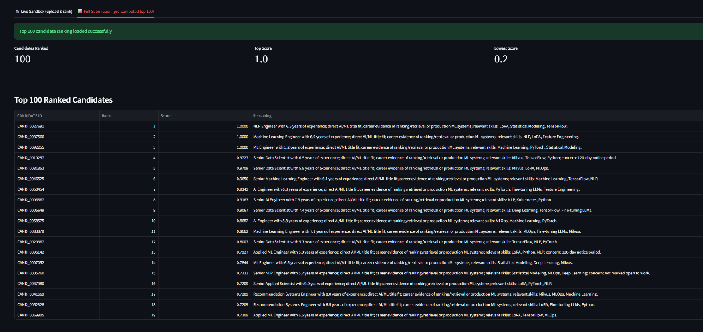
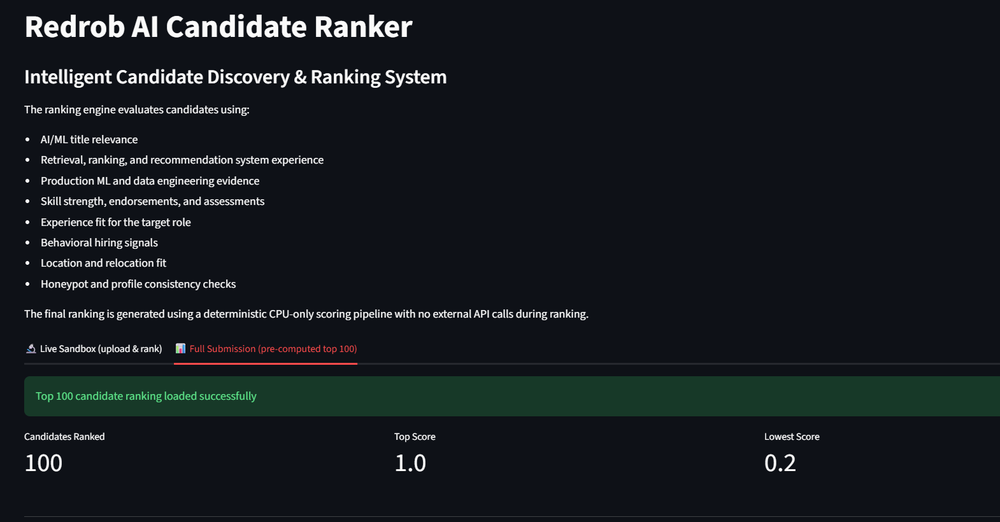
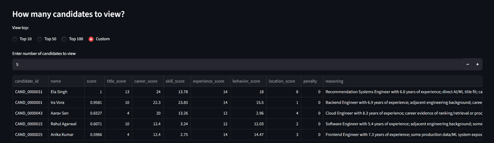
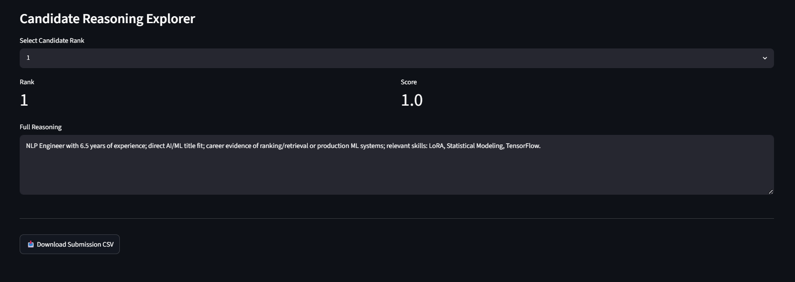
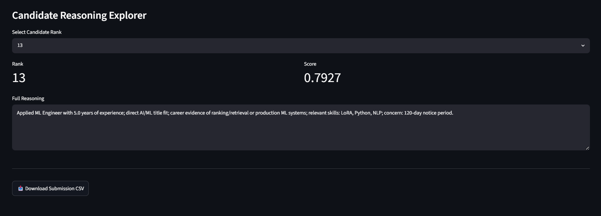
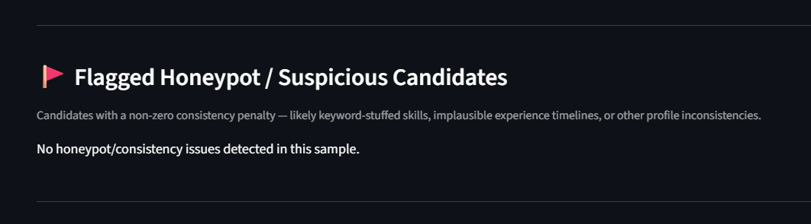

# Redrob AI Candidate Ranker

An AI-powered candidate discovery and ranking system built for the **Redrob Intelligent Candidate Discovery & Ranking Challenge**.

The system ranks the **Top 100 candidates** out of a pool of **100,000 profiles** for a Senior AI Engineer role, using a deterministic, fully explainable scoring framework — no hosted LLM calls, no GPU, CPU-only, fully reproducible.

**Live Sandbox:** [ai-ranker.streamlit.app](https://ai-ranker.streamlit.app/)

---

## What is the Redrob Challenge?

Redrob's Intelligent Candidate Discovery & Ranking Challenge asks participants to rank the 100 best-fit candidates from a 100,000-profile pool against a single job description, under strict compute constraints (≤5 min, ≤16GB RAM, CPU-only, no network during ranking).

The dataset is deliberately adversarial: it contains keyword-stuffed profiles, "behavioral twins" with near-identical skills but very different hire-ability, undersold but genuinely strong candidates, and ~80 honeypots with subtly impossible career histories. A system that just does keyword matching will rank many of these traps highly — a good system has to read the actual evidence in each profile.

---

## Problem Statement

Recruiters often receive thousands of candidate profiles for a single technical role. Traditional keyword matching fails because:

- Strong candidates may not list exact keywords
- Keyword-stuffed profiles can appear highly relevant
- Behavioral signals are ignored
- Career context is often lost

The ranking must:

- Complete within 5 minutes, on CPU only
- Be fully reproducible
- Generate explainable rankings
- Detect suspicious or keyword-stuffed profiles

---

## Solution Overview

The Redrob AI Candidate Ranker evaluates each candidate using a hybrid scoring system combining seven signals:

### 1. Title Relevance
Measures alignment between the candidate's career titles and the target role.

Examples — `Senior AI Engineer`, `ML Engineer`, `Data Scientist`, `NLP Engineer` — receive higher scores than unrelated roles.

### 2. Career Evidence Analysis
The system analyzes profile summary, career descriptions, and job history to identify evidence of:

- Ranking systems
- Recommendation systems
- Retrieval systems
- Semantic search
- Vector databases
- RAG pipelines
- LLM fine-tuning
- Production ML deployments

### 3. Skill Evaluation
Each role-relevant skill is weighted according to importance:

| Skill | Weight |
|---|---|
| Fine-tuning LLMs | 5.0 |
| NLP | 4.0 |
| Machine Learning | 4.0 |
| MLOps | 4.0 |
| LoRA | 3.5 |
| PyTorch | 3.5 |
| Milvus | 3.0 |

The score also incorporates proficiency level, duration of usage, endorsements, and assessment scores.

### 4. Experience Matching
Preferred experience range: **5–9 years**. Candidates outside the target range receive reduced scores.

### 5. Behavioral Signals
The ranking system incorporates recruiter-facing signals including:

- Open-to-work status
- Recruiter response rate
- Interview completion rate
- GitHub activity
- Profile completeness
- Saved-by-recruiters count
- Notice period

These signals help estimate hiring likelihood — not just qualification on paper.

### 6. Location Fit
Additional preference is given to candidates located in Pune, Noida, Bengaluru, Hyderabad, and Mumbai. Relocation willingness and work-mode preferences are also considered.

### 7. Honeypot Detection
The system penalizes suspicious profiles, including:

- Expert skills claimed with zero experience
- Skill inflation
- Experience inconsistencies
- Strong AI claims without supporting technical history

**Result on the actual 100K candidate pool: 0% honeypot rate in the final top 100** — well under the 10% disqualification threshold.

---

## Ranking Pipeline

```
Candidate Profile → Profile Parsing → Title Analysis → Career Evidence Analysis
→ Skill Scoring → Experience Scoring → Behavioral Scoring → Location Scoring
→ Honeypot Detection → Final Weighted Score → Top 100 Selection
→ Score Normalization → CSV Generation
```

---

## Output Format

```
candidate_id,rank,score,reasoning
```

Example:

```csv
CAND_0027691,1,1.0,"NLP Engineer with 6.5 years of experience; direct AI/ML title fit; career evidence of ranking/retrieval or production ML systems; relevant skills: LoRA, Statistical Modeling, TensorFlow."
```

---

## Live Demo

**Streamlit App:** [ai-ranker.streamlit.app](https://ai-ranker.streamlit.app/)

The sandbox has two views:

- **Live Sandbox** — upload your own small candidate sample (`.json` or `.jsonl`, ≤100 candidates), the app runs the real scoring engine end-to-end, and you can view Top 10 / Top 50 / Top 100 / a custom number of candidates, plus a dedicated honeypot/suspicious-profile view.
- **Full Submission Viewer** — browse the pre-computed top-100 submission with a candidate reasoning explorer.

A reference example of expected scored output is included at `outputs/top100_demo.json`.

### Screenshots

**Live Sandbox — landing view**


**Upload a candidate sample**


**Top 100 ranked candidates — pre-computed submission view**


**Live-ranked results from an uploaded sample**


**Choose how many candidates to view (Top 10 / 50 / 100 / Custom)**


**Candidate reasoning explorer**



**Flagged honeypot / suspicious candidates view**


### Demo Video

A full walkthrough of the sandbox — uploading a sample, live ranking, switching between Top 10/50/100/Custom views, and the honeypot tab.

 [Watch `demo_video.mp4`](./demo_video.mp4)

---

## Project Structure

```
Redrob-AI-candidate_Ranker/
├── data/
│   ├── candidates.jsonl              # not committed (~465MB) — see Data section below
│   ├── job_description.docx
│   ├── sample_candidates.json
│   ├── candidate_schema.json
│   ├── redrob_signals_doc.docx
│   ├── submission_spec.docx
│   └── validate_submission.py
│
├── outputs/
│   ├── submission.csv                # final top-100 deliverable
│   ├── ranked_candidates.csv         # debug file with full component scores
│   └── top100_demo.json              # reference example of expected scored output
│
├── app.py                            # Streamlit sandbox (live ranking + submission viewer)
├── main.py                           # core ranking engine
├── requirements.txt
├── submission_metadata.yaml
├── sandbox_colab.ipynb               # secondary, notebook-based sandbox
├── demo_video.mp4
├── *.png                             # sandbox screenshots
└── README.md
```

---

## Data

`data/candidates.jsonl` (~465MB uncompressed) is not committed to this repo since it exceeds GitHub's file size limits. To reproduce the full ranking:

1. Obtain `candidates.jsonl` (or the gzipped `candidates.jsonl.gz`) from the official hackathon bundle.
2. Place it inside `data/`.
3. `main.py` reads the gzipped version directly if needed — no manual decompression required.

---

## Installation

Clone the repository:

```bash
git clone https://github.com/Tanvii13/Redrob-AI-candidate_Ranker.git
cd Redrob-AI-candidate_Ranker
```

Create environment:

```bash
python -m venv venv
```

Windows:
```bash
venv\Scripts\activate
```

Install dependencies:

```bash
pip install -r requirements.txt
```

---

## Generate Submission

Single command:

```bash
python main.py
```

Output:

```
outputs/submission.csv
outputs/ranked_candidates.csv
```

**Execution time:** ~36 seconds on CPU for 100,000 candidates.

You can also run with explicit paths:

```bash
python main.py --candidates data/candidates.jsonl --job data/job_description.docx --out outputs/submission.csv
```

---

## Validation

```bash
python data/validate_submission.py outputs/submission.csv
```

Expected:

```
Submission is valid.
```

---

## Running the Sandbox Locally

```bash
streamlit run app.py
```

Open `http://localhost:8501`, switch to the **Live Sandbox** tab, and upload `data/sample_candidates.json` to test end-to-end ranking on a small sample — the same code path used in the hosted sandbox.

---

## Compute Environment

| Component | Value |
|---|---|
| CPU | 8 Cores |
| RAM | 16 GB |
| OS | Windows |
| Python | 3.14.5 |
| GPU | Not Required |
| Internet During Ranking | No |

---

## AI Tools Used

- ChatGPT
- Gemini

**Usage:** code review, implementation guidance, UI assistance.

**No external AI model or hosted API is called during candidate ranking.** The ranking engine (`main.py`) is local, deterministic, and produces identical output on every run.

---

## Methodology Summary

The ranking system evaluates candidates using a weighted combination of title relevance, career history, AI/ML skills, retrieval and ranking system experience, production engineering evidence, experience fit, behavioral availability signals, and location preferences. Career descriptions are analyzed for evidence of search, recommendation, retrieval, ranking, embeddings, vector search, evaluation frameworks, and production ML systems, reflecting the core requirements of the job description. Behavioral signals such as open-to-work status, recruiter responsiveness, platform activity, notice period, and relocation willingness are incorporated to estimate hiring likelihood. The system also performs profile consistency checks to identify likely keyword-stuffed or suspicious profiles, including unsupported expert-level skills, experience inconsistencies, and strong AI skill claims without corresponding technical career evidence. Final rankings are generated through a deterministic CPU-only weighted scoring framework with no external API calls, enabling reproducible execution within the competition compute constraints.

---

## Where Can This Approach Be Used?

While built for the Redrob Senior AI Engineer role, the same hybrid scoring framework — title relevance + career evidence + skill weighting + behavioral signals + honeypot detection — generalizes to any high-volume technical hiring pipeline where keyword search alone produces too much noise.

---

## Developed By

**Team Titans**
Tanvi Nakum

GitHub: [github.com/Tanvii13](https://github.com/Tanvii13)
