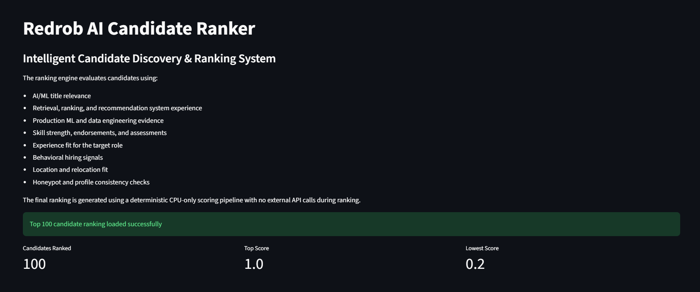
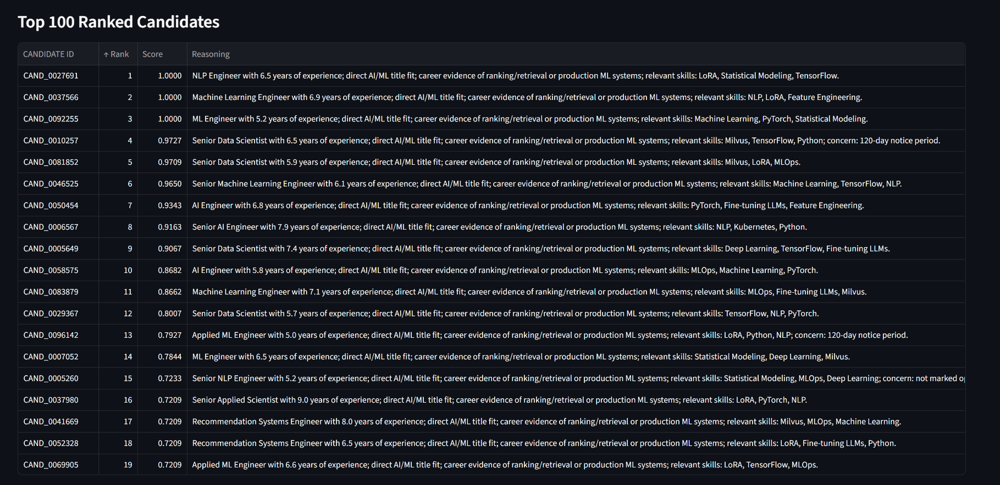

# Redrob AI Candidate Ranker

An AI-powered candidate discovery and ranking system built for the **Redrob Intelligent Candidate Discovery & Ranking Challenge**.

The system ranks the **Top 100 candidates** from a pool of **100,000 profiles** for a Senior AI Engineer role using a deterministic, explainable scoring framework.

---

# Problem Statement

Recruiters often receive thousands of candidate profiles for a single technical role.

Traditional keyword matching fails because:

- Strong candidates may not list exact keywords
- Keyword-stuffed profiles can appear highly relevant
- Behavioral signals are ignored
- Career context is often lost

The challenge requires ranking the **best 100 candidates** from a dataset of **100,000 candidates** for a Senior AI Engineer position.

The ranking must:

- Complete within 5 minutes
- Run on CPU
- Be reproducible
- Generate explainable rankings
- Detect suspicious or keyword-stuffed profiles

---

# Solution Overview

The Redrob AI Candidate Ranker evaluates each candidate using a hybrid scoring system that combines:

### 1. Title Relevance

Measures alignment between the candidate's career titles and the target role.

Examples:

- Senior AI Engineer
- ML Engineer
- Data Scientist
- NLP Engineer

receive higher scores than unrelated roles.

---

### 2. Career Evidence Analysis

The system analyzes:

- Profile summary
- Career descriptions
- Job history

to identify evidence of:

- Ranking systems
- Recommendation systems
- Retrieval systems
- Semantic Search
- Vector Databases
- RAG Pipelines
- LLM Fine-Tuning
- Production ML Deployments

---

### 3. Skill Evaluation

Each role-relevant skill is weighted according to importance.

Examples:

| Skill | Weight |
|---------|---------|
| Fine-tuning LLMs | 5.0 |
| NLP | 4.0 |
| Machine Learning | 4.0 |
| MLOps | 4.0 |
| LoRA | 3.5 |
| PyTorch | 3.5 |
| Milvus | 3.0 |

The score incorporates:

- Proficiency level
- Duration of usage
- Endorsements
- Assessment scores

---

### 4. Experience Matching

Preferred experience range:

- 5–9 years

Candidates outside the target range receive reduced scores.

---

### 5. Behavioral Signals

The ranking system incorporates recruiter-facing signals including:

- Open-to-work status
- Recruiter response rate
- Interview completion rate
- GitHub activity
- Profile completeness
- Saved-by-recruiters count
- Notice period

These signals help estimate hiring likelihood.

---

### 6. Location Fit

Additional preference is given to candidates located in:

- Pune
- Noida
- Bengaluru
- Hyderabad
- Mumbai

Relocation willingness and work-mode preferences are also considered.

---

### 7. Honeypot Detection

The system penalizes suspicious profiles.

Examples:

- Expert skills with zero experience
- Skill inflation
- Experience inconsistencies
- Strong AI claims without technical history

This reduces keyword-stuffing and improves ranking quality.

---

# Ranking Pipeline

Candidate Profile -> Profile Parsing -> Title Analysis -> Career Evidence Analysis -> Skill Scoring -> Experience Scoring -> Behavioral Scoring -> Location Scoring -> Honeypot Detection -> Final Weighted Score -> Top 100 Selection -> CSV Generation

---

# Output Format

The generated submission contains:

```text
candidate_id,rank,score,reasoning
```

Example:

```csv
CAND_0027691,1,1.0,"NLP Engineer with 6.5 years of experience..."
```

---

# Project Structure

```text
Redrob-AI-candidate_Ranker/

├── data/
│   ├── candidates.jsonl
│   ├── job_description.docx
│   ├── sample_candidates.json
│   └── validate_submission.py
│
├── outputs/
│   ├── submission.csv
│   └── ranked_candidates.csv
│
├── src/
│   ├── skill_matcher.py
│   ├── behavior_ranker.py
│   ├── production_matcher.py
│   ├── reasoning_generator.py
│   └── final_ranker.py
│
├── app.py
├── main.py
├── requirements.txt
├── submission_metadata.yaml
└── README.md
```

---

# Installation

Clone repository:

```bash
git clone https://github.com/Tanvii13/Redrob-AI-candidate_Ranker.git

cd Redrob-AI-candidate_Ranker
```

Create environment:

```bash
python -m venv venv
```

Windows:

```bash
venv\Scripts\activate
```

Install dependencies:

```bash
pip install -r requirements.txt
```

---

# Generate Submission

Single command:

```bash
python main.py
```

Output:

```text
outputs/submission.csv
outputs/ranked_candidates.csv
```

Execution time:

```text
~36 seconds on CPU
```

for 100,000 candidates.

---

# Validation

Run:

```bash
python data/validate_submission.py outputs/submission.csv
```

Expected:

```text
Submission is valid.
```

---

# Sandbox / Demo

Streamlit Demo:

https://ai-ranker.streamlit.app/

The sandbox demonstrates:

- Ranking workflow
- Candidate analysis
- Submission generation

A smaller sample dataset is used for demonstration purposes.

Redrob AI Candidate Ranker



Top 100 Ranked Candidates



Candidate Reasoning Explore


.png)

.png)

---

# Compute Environment

| Component | Value |
|------------|---------|
| CPU | 8 Cores |
| RAM | 16 GB |
| OS | Windows |
| Python | 3.14 |
| GPU | Not Required |
| Internet During Ranking | No |

---

# AI Tools Used

- ChatGPT
- Gemini

Usage:

- Architecture design
- Code review
- UI assistance

No external AI model or hosted API is used during candidate ranking.

---

# Methodology Summary

The ranking system evaluates candidates using a weighted combination of title relevance, career evidence, AI/ML skill strength, production engineering experience, behavioral hiring signals, location fit, and profile consistency checks. Career descriptions are analyzed for evidence of ranking systems, recommendation systems, retrieval pipelines, vector databases, LLM applications, and production machine learning deployments. Behavioral signals such as recruiter responsiveness, platform activity, notice period, and relocation willingness are incorporated to estimate hiring probability. Suspicious profiles are penalized through consistency checks to reduce keyword-stuffing and improve ranking quality. The entire pipeline is deterministic, CPU-only, reproducible, and requires no external API calls.

---

# Developed By

### Team Titans

**Tanvi Nakum**

GitHub:
https://github.com/Tanvii13
